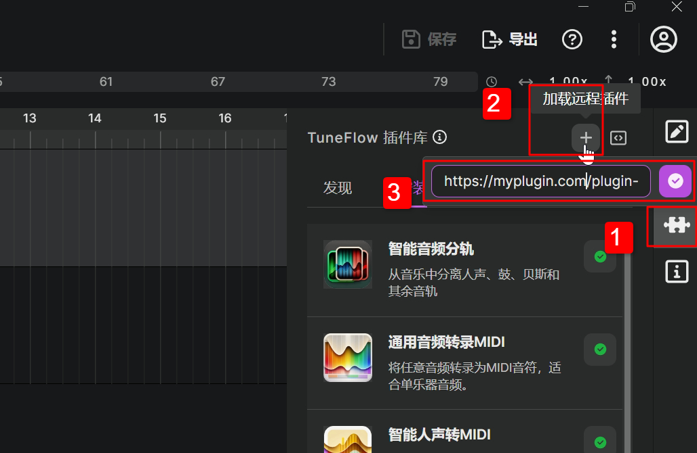

# 部署你的插件

## 部署准备工作

### 清理 bundle.json

- 首先检查你的 bundle.json 中的插件名称，开发者名称，和插件介绍是否填写完整。一个好的介绍可以帮助用户更轻松地上手。
- 清除 bundle.json 中的 `isInDevelopment`。这个参数适用于开发中的插件，避免它在开发过程中被其他用户安装。当你打算部署插件时，你应该移除这个值，否则你的用户安装时将会报错。

### 用 `BytesIO` 或 `tempfile` 读写文件

插件在服务器端运行时可能会收到大量用户的请求，如果采用常规的文件操作写入到某个普通目录，将会导致磁盘负荷较大，造成很高的延迟，同时大量的文件也会占据硬盘空间。因此我们强烈建议你将所有的文件 IO 操作都用 `BytesIO` 或者 `tempfile` 来进行。

## 优化插件性能

在开始部署你的插件之前，你需要对你的插件进行一些性能上的调教。这不仅是因为用户对延迟非常敏感，也因为未经优化的插件在长期运行时可能为服务器带来不必要的负担。

### 优化模型加载

如果你的模型较大，每次请求时都读取模型显然会有大量的磁盘读取操作，造成较高的延迟。如果你的服务器内存或 GPU 空间足够大，你可以将模型加载到一个全局的变量中，然后在 `def run` 方法中使用全局的模型变量。

<!-- prettier-ignore-start -->
::: tip
tuneflow-devkit-py 的 `Runner` 默认采用多线程模型，在多线程执行中不会造成更多的模型内存占用。如果你的代码用到了多进程，则每个进程会存储单独的一份模型，在这种情况下你可能需要考虑服务器的存储空间是否足够。
:::
<!-- prettier-ignore-end -->

### 优化音频数据传输

当你的参数是音频参数，即 `InjectFrom.ClipAudioData` 类型时，你可能并不需要完整的音频，也并不需要原始音质的音频。比如，如果你制作的是一个音频转录 MIDI 的插件，你只需要选中片段可见部分的音频，并且音质可能只需要以 22kHz 采样即可。在这种情况下，提供一个 [convert](https://github.com/tuneflow/tuneflow-py/blob/main/src/tuneflow_py/descriptors/param.py#L16) 配置可以显著降低网络延迟。

```python
...
    "injectFrom": {
        "type": InjectSource.ClipAudioData.value,
        "options": {
            "clips": "selectedAudioClips",
            "convert": {
                "toFormat": "ogg",
                "options": {
                    "sampleRate": 44100
                }
            }
        }
    }
...
```

## 用 Runner 编写插件服务器

[Runner](https://github.com/tuneflow/tuneflow-devkit-py/blob/main/src/tuneflow_devkit/runner.py) 是基于 [FastAPI](https://fastapi.tiangolo.com/) 实现的一个 TuneFlow 插件服务器。基本上你可以简单地把 `Debugger` 换成 `Runner`，再加一些简单的配置，就可以写好你的插件服务器。通常我们把这个服务器文件命名为 `app.py`，一个简单的例子如下：

```python
# app.py
from plugin import BasicPitchTranscribe
from tuneflow_devkit import Runner
from pathlib import Path
import uvicorn

app = Runner(plugin_class_list=[BasicPitchTranscribe], bundle_file_path=str(Path(__file__).parent.joinpath('bundle.json').absolute())).start(path_prefix='/plugin-service/basic_pitch')

if __name__ == "__main__":
    uvicorn.run(app, host="0.0.0.0", port=8000)

```

如果你需要在服务器端支持更多功能，例如身份验证或者是跨域(CORS)检验，也可以通过添加 `config` 或者是直接操作返回的 `app` 实例。

```python
# app.py
...

app = Runner(...).start(...)

@app.middleware("http")
async def my_app(request: Request, call_next):
    response = await call_next(request)
    # Do something with the response
    ...
    return response
```

## 运行插件服务器

默认情况下 `Runner` 使用 [uvicorn](https://www.uvicorn.org/) 来运行插件服务器，它是一个轻量级的 Python ASGI 服务器，可以支持常见的 Python 异步编程模式。例如在上面的`app.py` 的例子中，我们可以简单地启动服务器：

```bash
python app.py
```

如果你对于负载平衡等有更高的要求，你也可以在此基础上再加一层如 [Nginx](https://www.nginx.com/) 的反向代理服务器。

## 在 TuneFlow 中运行你的插件

服务器运行起来后，任何人都可以通过插件库面板上方的 **加载远程插件** 按钮来加载你的插件到插件库中。这里的插件地址格式为:

```
https://<your_server_host_name>/<plugin_path_prefix>
```

这里的 `<plugin_path_prefix>` 即为你在 `app.py` 中提供的 `path_prefix`。



## 发布到 TuneFlow 插件库

想让你的插件出现在 TuneFlow 插件库中吗？你可以给我们的 [Demo Repository](https://github.com/tuneflow/tuneflow-py-demos) 提交 Pull Request，将你的 plugin repository 添加为一个 submodule。或者直接[联系我们](mailto:contact@info.tuneflow.com)。
